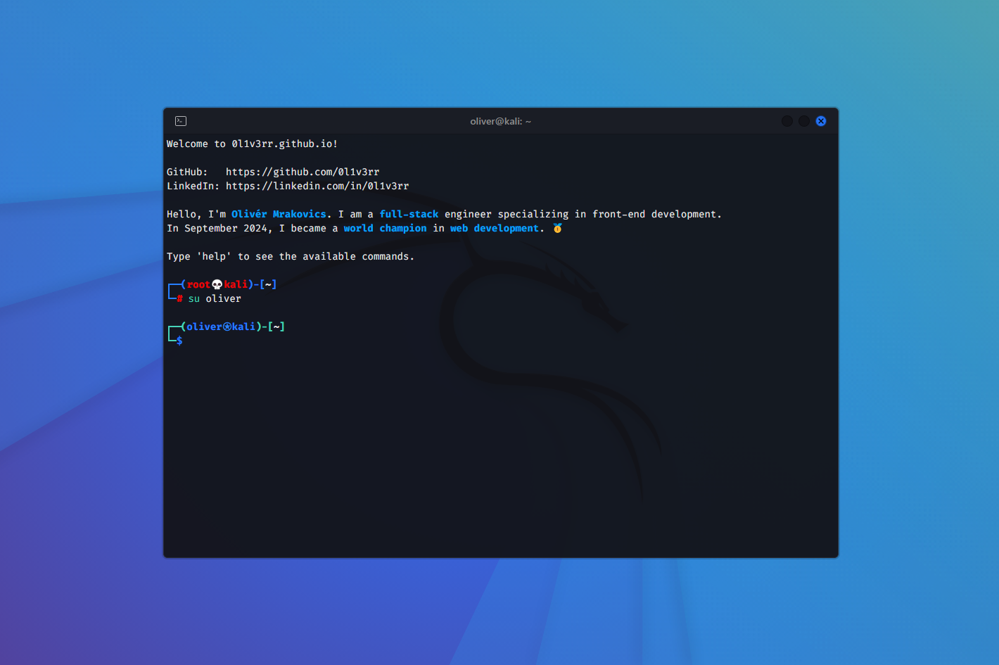

<h1><a href="https://dev-chenxing.github.io/terminal/" target="_blank">Terminal-Style Website</a></h1>



## Features

- Basuc commands
- Tab autocomplete
- Hotkeys


## Building from source

```sh
# 1. Clone the repo
git clone https://github.com/dev-chenxing/terminal.git
cd terminal

# 2. Install the necessary dependencies
npm i --verbose

# 3. Run the app
npm run dev
```
